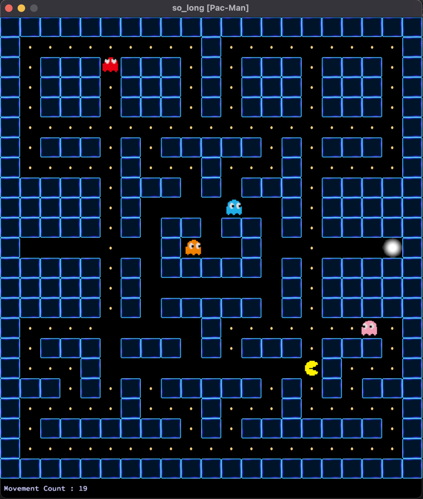
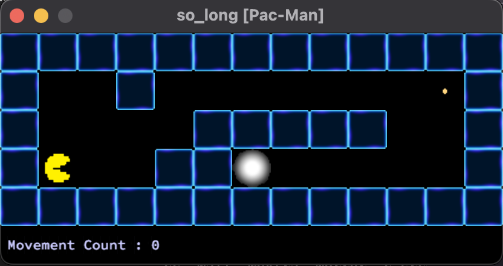
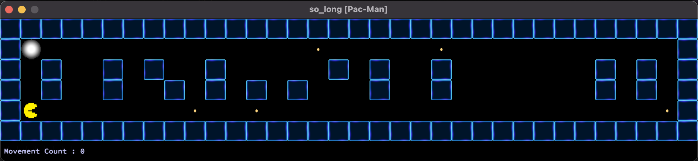
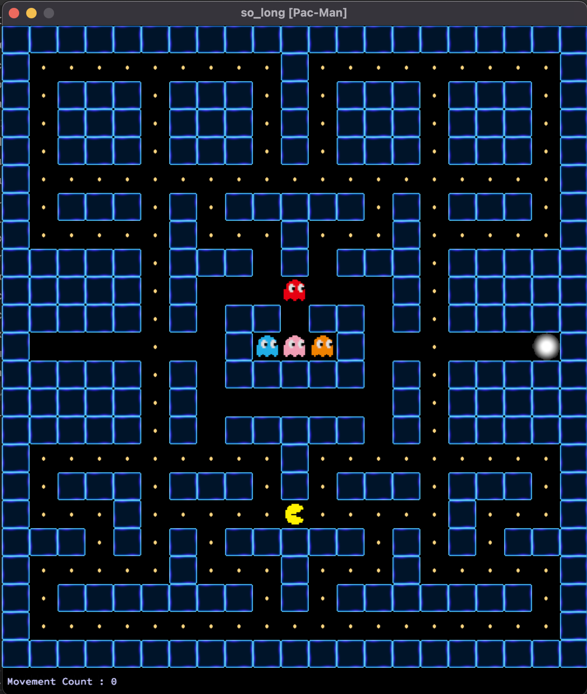
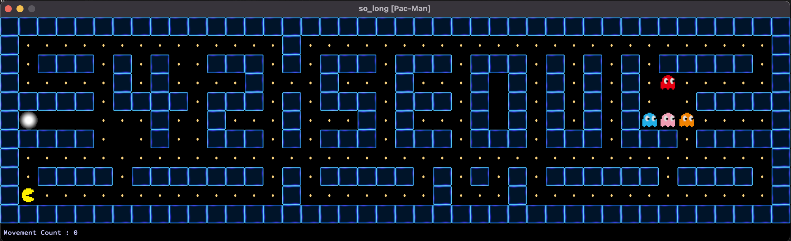
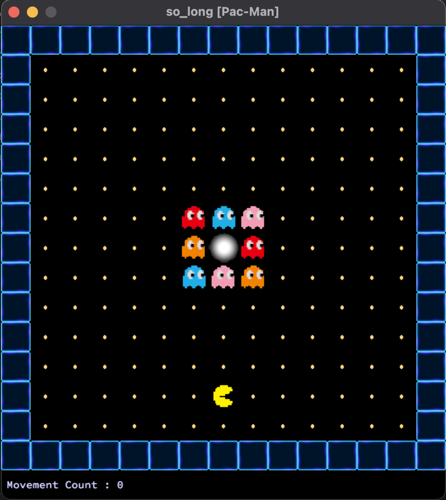
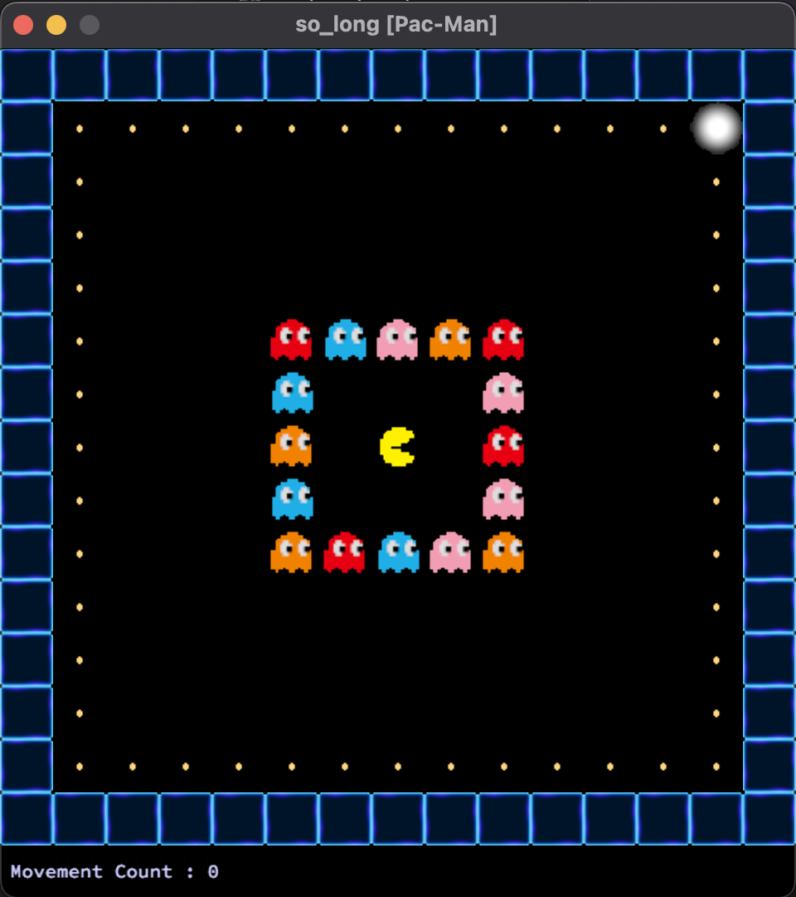

# so_long

miniLibX를 사용하여 간단한 2D 게임 개발

## miniLibX

miniLibX는 X-Window와 Cocoa에 대한 지식 없이도 화면에서 무엇인가를 렌더링하기 위한 가장 기본적인 작업을 수행할 수 있는 작은 그래픽 라이브러리

참고 문서 : https://harm-smits.github.io/42docs/libs/minilibx/introduction.html

# Pac-Man (so_long)

<div align="center">
  
</div>

## Getting Started

### Clone repository

```
git clone https://github.com/Eucha09/so_long.git
cd so_long
```

### Install miniLibX

```
cd mlx
make
cd ..
```

### Install Pac-Man(so_long)

```
make bonus
```

### Usage

```
./so_long [맵 파일 경로] 
```
ex)
```
./so_long maps/classic.ber
```

### How to play

|KEYBOARD|ACTION|
|---|---|
|`W`, `↑`|Move up|
|`S`, `↓`|Move down|
|`A`, `←`|Move left|
|`D`, `→`|Move right|
|`R`|Retry game|
|`ESC`|Close the game window|

### Maps

- ```maps/tutorial1.ber```   


- ```maps/tutorial2.ber```   


- ```maps/classic.ber```   


- ```maps/42seoul.ber```   


- ```maps/survival1.ber```   


- ```maps/survival2.ber```   
